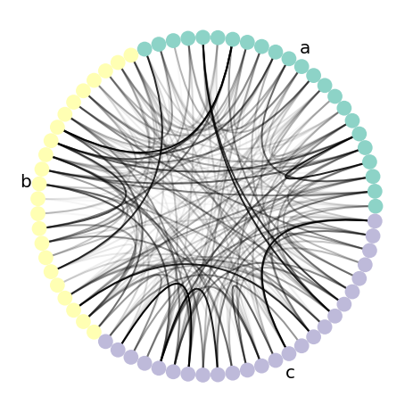

# nxviz: Composable and rational network visualizations in matplotlib

`nxviz` is a package for building _rational_ network visualizations
using matplotlib as a backend.
Inspired heavily by the principles espoused in the grammar of graphics,
nxviz provides ways to _compose_ a graph visualization together
by adhering to the following recipe:

1. Prioritize node placement, mapping data to position and visual properties,
2. Draw in edges, mapping data to visual properties,
3. Add in annotations and highlights on the graph.

`nxviz` is simultaneously a data visualization research project,
art project,
and declarative data visualization tool.
We hope you enjoy using it to build beautiful graph visualizations.

## Installation

### Official Releases

`nxviz` is available on PyPI:

```bash
pip install nxviz
```

It's also available on conda-forge:

```bash
conda install -c conda-forge nxviz
```

### Pre-releases

Pre-releases are done by installing directly from git:

```bash
pip install git+https://github.com/ericmjl/nxviz.git
```

## Quickstart

To make a Circos plot:

```python
# We assume you have a graph G that is a NetworkX graph object.
# In this example, all nodes possess the "group" and "value" node attributes
# where "group" is categorical and "value" is continuous,
# and all edges have the "edge_value" node attribute as well.

import nxviz as nv
ax = nv.circos(
    G,
    group_by="group",
    sort_by="value",
    node_color_by="group",
    edge_alpha_by="edge_value"
)

nv.annotate.circos_group(G, group_by="group")
```



For more examples, including other plots that can be made,
please see the examples gallery on the docs.
