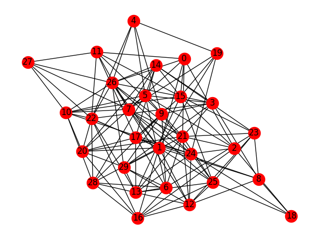
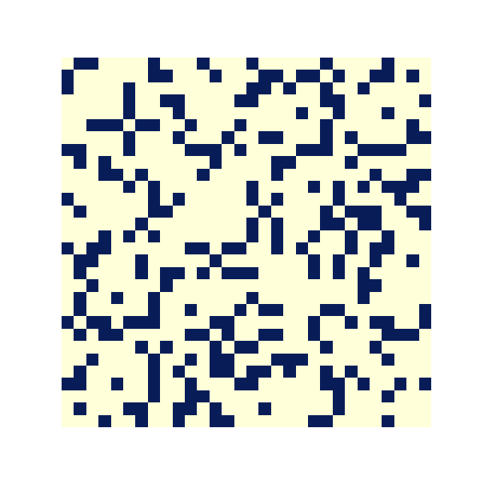
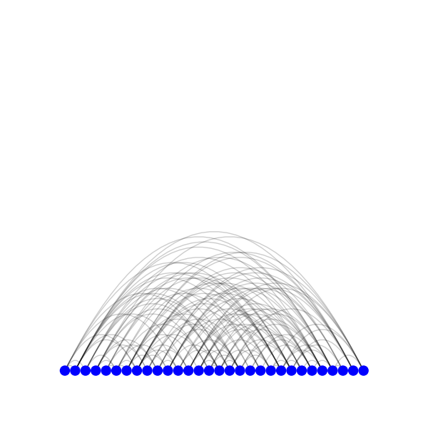
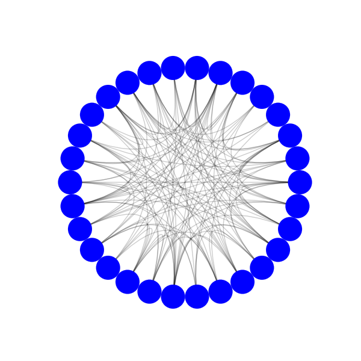

=====
Usage
=====

.. toctree::
   :maxdepth: 4

.. To use nxviz in a project::
.. 
..     from nxviz.plots import CircosPlot
.. 
..     # Assume we have a professional network of physicians belonging
..     # to hospitals.
..     c = CircosPlot(G,
..                    node_color='affiliation',
..                    node_grouping='affiliation')
..     c.draw()
.. 
..     plt.show()  # only needed in scripts

Plots
=====
All nxviz plot objects take in a Networkx graph object and output a plot object. The following examples will use a randomly generated Networkx graph. The following code uses Networkx's built-in drawing function. ::

    import networkx as nx
    import matplotlib.pyplot as plt

    er = nx.erdos_renyi_graph(30, 0.3)
    nx.draw(er)
    plt.show()

    
    Networkx built-in draw function

Matrix Plots
------------

::

    from nxviz.plots import MatrixPlot

    m = MatrixPlot(er)
    m.draw()
    plt.show()

    
    nxviz matrix plot

Arc Plots
---------

::

    from nxviz.plots import ArcPlot

    a = ArcPlot(er)
    a.draw()
    plt.show()

    
    nxviz arc plot

Circos Plots
------------

::

    from nxviz.plots import CircosPlot

    c = CircosPlot(er)
    c.draw()
    plt.show()

    
    nxviz Circos plot

For a full list of parameters, see the :py:class:`nxviz.plots.CircosPlot` API documentation. 

-------------

The above is a basic overview of the available plots. For more detailed examples of these plots in action, please see the `examples here <https://github.com/ericmjl/nxviz/tree/master/examples>`_.
